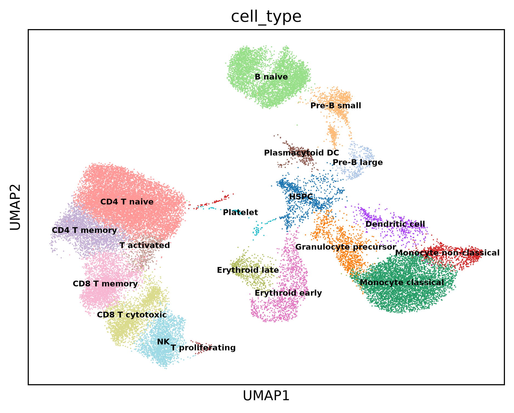
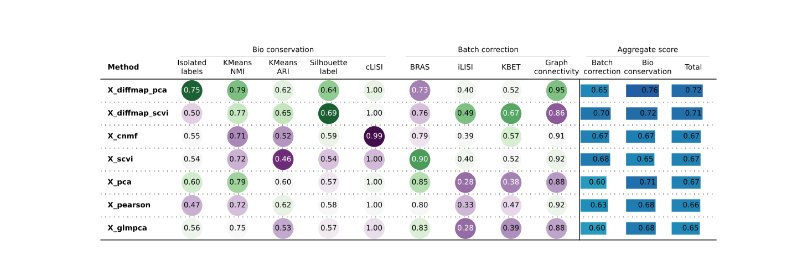

# bm_scrna_methods

Single-cell RNA-seq methods on human bone marrow (BMMC). A self-directed
project to practise the single-cell workflow end to end: quality control, a
dimensionality-reduction benchmark, pathway analysis, trajectory inference,
cell-cell communication, and (next) deconvolution. Built on the Python /
Scanpy stack.



## Data

Hay et al. 2018 Human Cell Atlas bone marrow (BMMC): eight donor lanes, full
set, with 19 fixed cell-type labels.

The annotated object `data/processed/bm_annotated.h5ad` (~200 MB) is tracked
with Git LFS. After cloning:

```bash
git lfs install
git lfs pull
```

Raw 10x matrices, velocity looms/BAMs and external references (gene sets,
ligand-receptor resources) are not in the repository. Place them under
`data/raw` and `data/external` to re-run from the start; every later stage
reads only `data/processed/bm_annotated.h5ad`.

## Pipeline

| Stage | What | Code |
|------|------|------|
| 0 | Load and merge the eight donor matrices | `src/load_data` |
| 1 | QC and doublets, normalise + HVG + PCA, clustering, annotation | `src/qc`, `src/preprocess`, `src/cluster`, `src/annotate` |
| 2 | Dimensionality-reduction benchmark: PCA, Pearson+PCA, GLM-PCA, scVI, diffusion maps, cNMF, scored with scib-metrics | `src/benchmark` |
| 3 | Pathway analysis (decoupler, gseapy) | `src/pathway` |
| 4 | Trajectory: PAGA, Palantir, CellRank, driver genes, gene trends, principal tree, RNA velocity | `src/trajectory` |
| 5 | Cell-cell communication (LIANA) | `src/cell_cell_communication` |
| 6 | Deconvolution (Scaden) | next |



## Layout

```
data/        raw | interim | processed | external
doks_info/   one plain-English note per stage
envs/        constraints.txt and per-env package snapshots
figures/     one subfolder per stage
notebook/
results/     one subfolder per stage, then one per script
src/         load_data qc preprocess cluster annotate benchmark
             pathway trajectory cell_cell_communication
```

Each script writes its tables to `results/<stage>/<script>/` and its figures to
`figures/<stage>/`. Cell-type labels stay fixed and are never given to the
methods — they are the independent check on every result.

## Environments

conda, three environments:

- **sc_core** (Python 3.13) — main stack, including scVI and scVelo; pinned
  through `envs/constraints.txt` (wired in with `PIP_CONSTRAINT`).
- **sc_deconv** (Python 3.11) — Scaden.
- **rna_velo** (Python 3.11) — velocyto.

Package snapshots: `envs/sc_core_linux.txt`, `envs/sc_core_arm64.txt` (Mac
dev), `envs/sc_deconv.txt`, `envs/rna_velo.txt`.

The `numpy<2.4` pin in `constraints.txt` is for scVelo on the Linux box; the
Mac dev environment runs numpy 2.5.x.

## Running

Each script runs as a plain file from the repository root:

```bash
conda activate sc_core
python src/load_data/load_data.py
```

Embeddings and some per-cell matrices are saved as `.npy` under `results/` and
are git-ignored; they rebuild from the benchmark and trajectory scripts.

## Notes

- Hardware: Linux (32 GB RAM, NVIDIA GPU for scVI) is the main box; a Mac M4 is
  used for development and plots.
- Figures are saved at dpi 300 with the Agg backend.
- This is a learning project, not a packaged tool.
